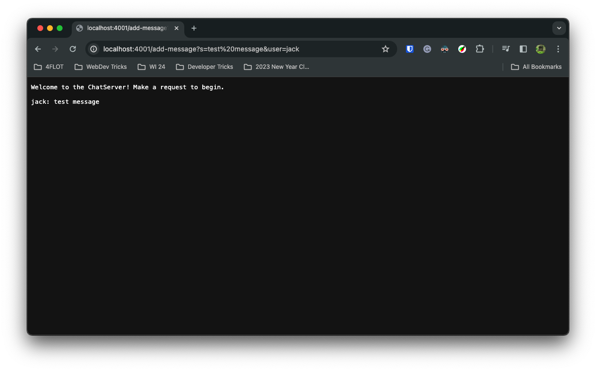
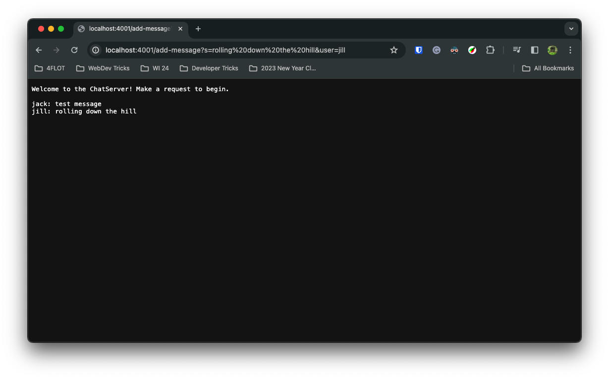
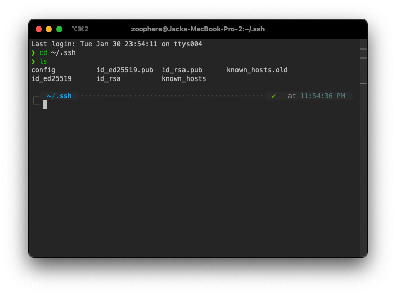
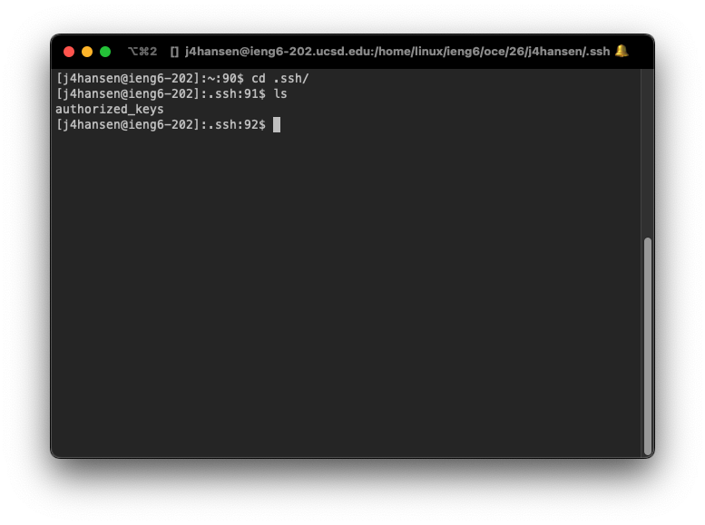
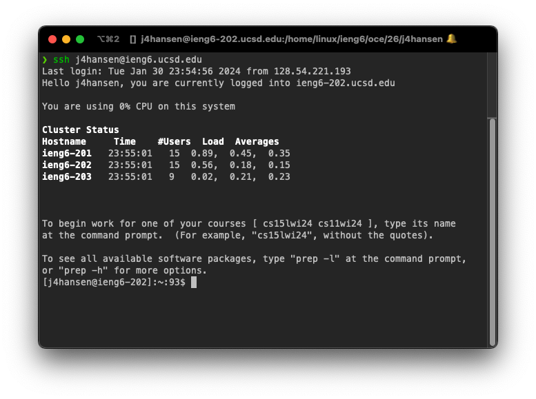

# CSE 15L Lab 2

Jacob Hansen

PID: A18031849

# Part 1

## Source for `ChatServer.java`

```java
import java.io.IOException;
import java.net.URI;

class Handler implements URLHandler {
    // The data this server will keep track of, chat
    // each new message will be concatenated to
    String chat = "Welcome to the ChatServer! Make a request to begin.\n\n";
    // i added a header message because when chat is "" the background is white
    // and once chat is not empty the background is black

    public String handleRequest(URI url) {
        if (url.getPath().equals("/")) {
            return chat;
        } else {
            String message; // stores message,
            String user; // store user for readability
            String[] parameters = url.getQuery().split("&");
            // if first param is of form "s=something"
            if (parameters[0].substring(0, 2).equals("s=")) {
                // take the part after "s="
                message = parameters[0].substring(2);
            } else {
                return "Error in parsing message string!";
            }
            // if second param is of form "user=billiam"
            if (parameters[1].substring(0, 5).equals("user=")) {
                // take the part after "user="
                user = parameters[1].substring(5);
            } else {
                return "Error in parsing user string!";
            }
            // add to chat in the right format
            chat += String.format("%s: %s\n", user, message);
            return chat;
        }
    }
}

class ChatServer {
    public static void main(String[] args) throws IOException {
        int port;
        // If no arguments provided, return
        if (args.length == 0) {
            System.out.println("Missing port number! Try any number between 1024 to 49151");
            return;
        }
        try { // if parseInt throws error, port argument is not a string and catch that error
            port = Integer.parseInt(args[0]);
        } catch (NumberFormatException error) {
            System.out.println("Port must be a number! Try any number between 1024 and 49151");
            throw error;
        }

        Server.start(port, new Handler());
    }
}
```

## Screenshots



### Method Calls

1. `ServerHttpHandler.handle(final HttpExchange exchange)`

   When the browser connects to localhost:4001 (port in my case) with the path `/add-message?s=test%20message&user=jack` it starts an exchange with the server of type HttpExchange as argument.

2. `Handler.handleRequest(URI url)`

   The server gets the request URI out of the exchange and passes it to `handleRequest`

3. `URI.getPath().equals("/")`

   This gets the path of the URI. If it is "/" it's just the root and print the chat

4. `URL.getQuery().split("&")`

   Gets the query from the URI, the part after the /, and splits it into a String[] by the &

5. The rest of the methods are basic String methods, `substring`, `equals`, `format`



1. `ServerHttpHandler.handle(final HttpExchange exchange)`

   When the browser connects to localhost:4001 (port in my case) with the path `/add-message?s=rolling%20down%20the%20hill&user=jill` it starts an exchange with the server of type HttpExchange as argument.

2. `Handler.handleRequest(URI url)`

   The server gets the request URI out of the exchange and passes it to `handleRequest`

3. `URI.getPath().equals("/")`

   This gets the path of the URI. If it is "/" it's just the root and print the chat

4. `URL.getQuery().split("&")`

   Gets the query from the URI, the part after the /, and splits it into a String[] by the &

5. The rest of the methods are basic String methods, `substring`, `equals`, `format`

# Part 2







# Part 3

I learned about how to write a web server in Java from scratch. I think what was most interesting was being able to parse queries from the URI. I have always wondered why the URL at the top of my browser sometimes looks so crazy, and now I about how to break it down into pieces that make sense.
